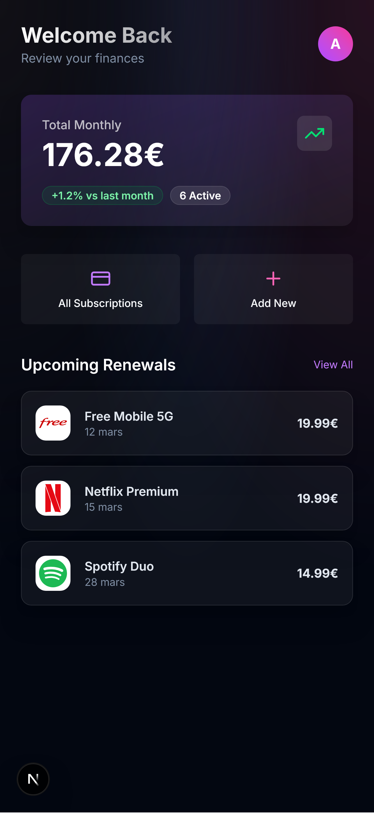
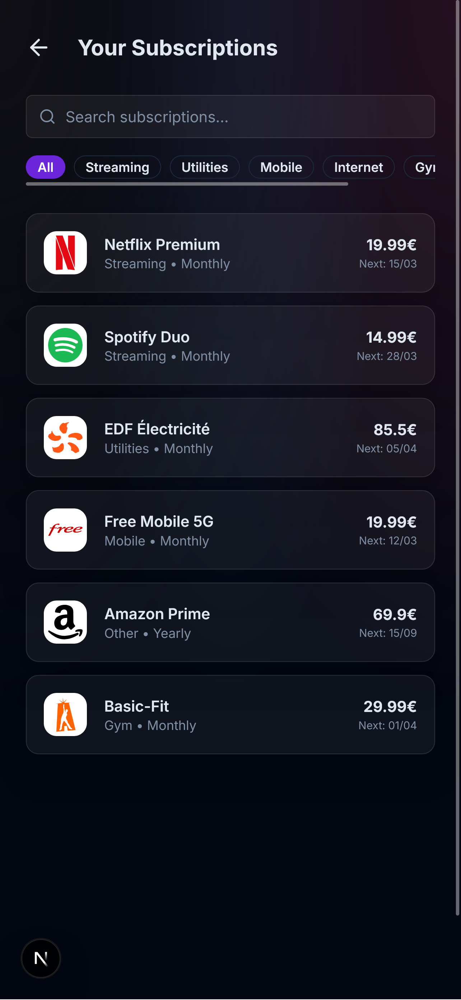
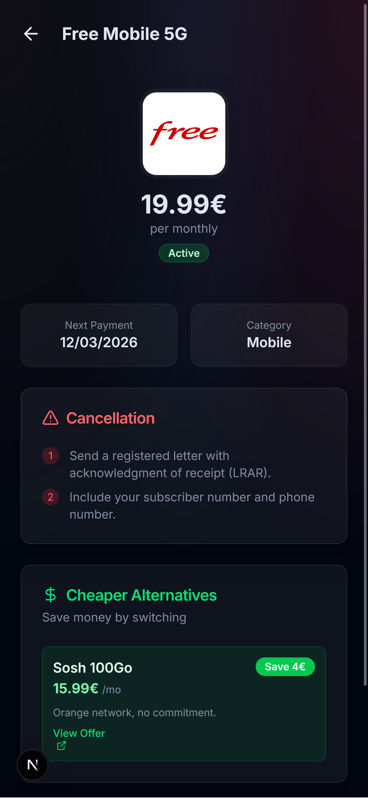
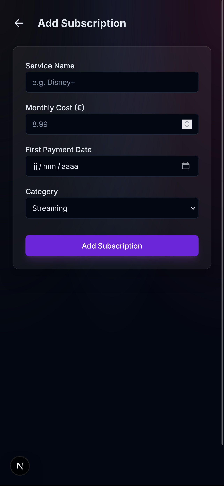

# SubManager

A mobile-first subscription management application that gives users a clear overview of their recurring expenses. Track every subscription, monitor upcoming payments, analyse spending by category, and find cheaper alternatives — all from a single interface.

---

## Screenshots

| Dashboard | All Subscriptions |
|-----------|------------------|
|  |  |

| Subscription Detail | Add Subscription |
|--------------------|-----------------|
|  |  |

---

## Features

- **Dashboard** — At-a-glance view of total monthly spending, number of active subscriptions, and the three most upcoming payment dates.
- **Subscription list** — Browse all subscriptions grouped and filtered by category, with billing cycle and next payment date.
- **Subscription detail** — Full information per subscription including logo, price, billing cycle, start date, step-by-step cancellation instructions, and suggested cheaper alternatives.
- **Spending analysis** — Visual category breakdown showing where money goes each month as absolute values and percentages.
- **Add subscription** — Form to register a new subscription with service name, price, billing cycle, and category.

---

## Tech Stack

| Layer | Technology |
|-------|-----------|
| Framework | [Next.js 16](https://nextjs.org) — App Router |
| Language | TypeScript 5 |
| Styling | Tailwind CSS v4 |
| UI Components | Custom components built with `class-variance-authority` |
| Icons | [Lucide React](https://lucide.dev) |
| Date utilities | [date-fns](https://date-fns.org) |
| Runtime | React 19 |

---

## Getting Started

### Prerequisites

- Node.js 18 or later
- npm, yarn, pnpm, or bun

### Installation

```bash
git clone https://github.com/your-username/SubManager.git
cd SubManager
npm install
```

### Development

```bash
npm run dev
```

Open [http://localhost:3000](http://localhost:3000) in your browser.

### Production build

```bash
npm run build
npm run start
```

---

## Project Structure

```
src/
├── app/
│   ├── page.tsx              # Dashboard
│   ├── subscriptions/        # All subscriptions list
│   ├── subscription/[id]/    # Subscription detail page
│   ├── analysis/             # Spending analysis
│   └── add/                  # Add subscription form
├── components/
│   └── ui/                   # Reusable UI components (Button, Card, Badge, Input)
├── lib/
│   ├── mockData.ts           # Sample subscription data
│   └── utils.ts              # Utility functions
└── types/
    └── index.ts              # TypeScript type definitions
```

---

## Roadmap

- Backend integration with a database (PostgreSQL / Supabase)
- Authentication and per-user subscription storage
- Push notifications for upcoming payments
- CSV / PDF export of spending history
- Currency conversion support

---

## License

This project is open source and available under the [MIT License](LICENSE).
